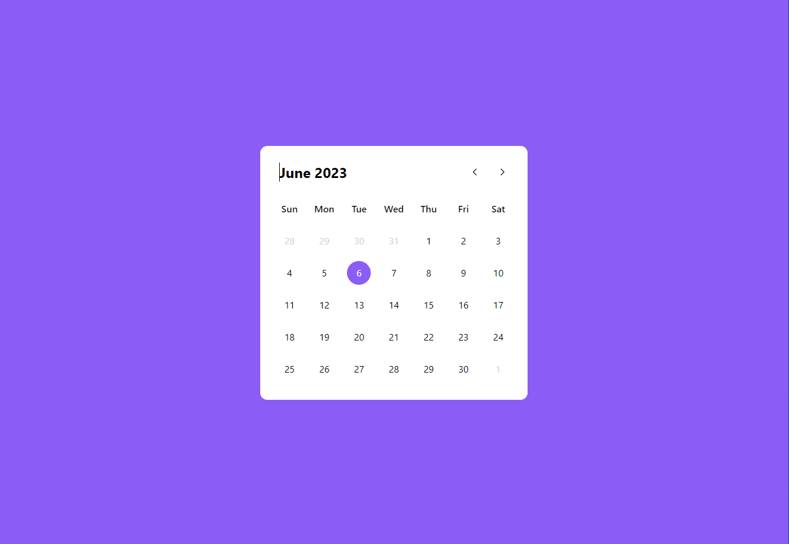

# Calendar V1

Tech Stack used in this :
\Js - Tailwind

Here is a preview of the output :

This a personal project for a simple calendar
More features will be added next

## TODO For V2

-Do the same project with react components

-Add a screen with diffrent months

-Add a screen with diffrent years

-Add Dark mode Toggle

-Add tasks As a stacked list just to the side (MEAN-MERN)

-Add diffrent types of tasks : personal, professional .. (MEAN-MERN)
